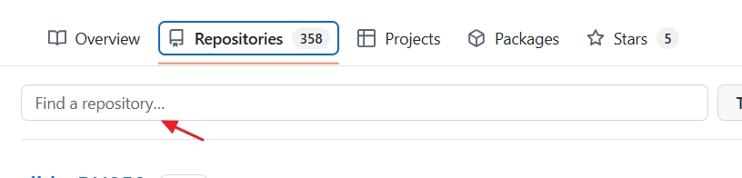
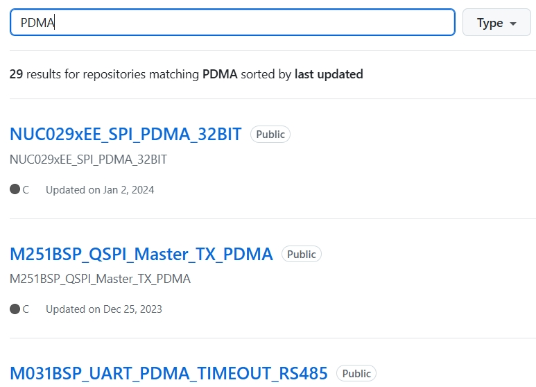
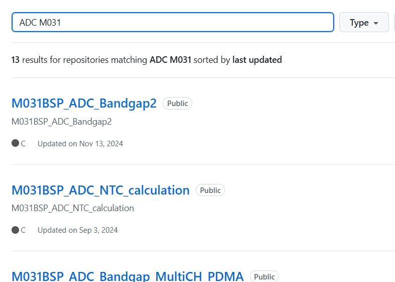
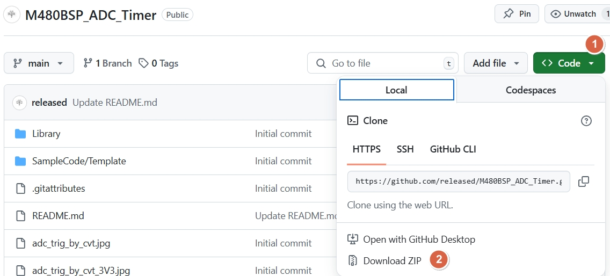

[return to index](https://released.github.io/)

# Example code

[try some example code ?](https://github.com/released/ "try some example code ?")

* entry __github repositories__

* use __search__ to find example code

* use __keyword__ , to search project
ex : __I2C__ , __ADC__ , etc and select the project 

* use __combo keyword__ , to search project
ex : __M031 ADC__ , etc and select the project 

* how to __download project__ ?

Code > Download ZIP

---

